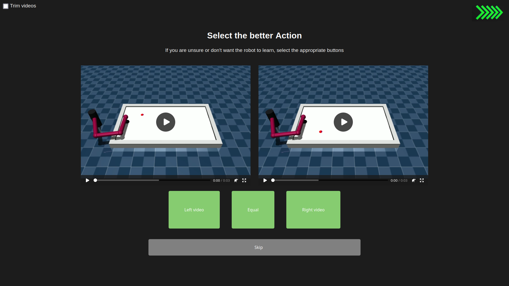

# Reinforcement Learning Trainer


This projects builds upon the [fancy_gym](https://github.com/ALRhub/fancy_gym) fork of OpenAI Gym and aims to provide an easy way for doing Reinforcement Learning from Human Feedback (RLHF) for RL agents.

## Structure

The framework has generally three components:

- **Data Collection** - giving the user a graphical interface to give preferences on trajectories and collecting them into a dataset
- **Reward Function Aggregation** - allowing the user to choose an algorithm for the aggregation of the preference data into a reward function or some other function from which the agent can be trained
- **Training the Agent on the Preferences** - allowing the user to specify how the policy should be extracted from the reward function

The last two steps may be done in one step (e.g. with DPO) or, more generally, follow a different control flow, depending on the chosen learning algorithm!

## Motivation
While Reinforcement Learning offers the ability of learning superhuman skills, it is often difficult to effectively model the reward function for some problems. 

For this reason *Imitation Learning* has been developed to alleviate this by approximating the reward function from preferences. 

Due to the success of ChatGPT, *RLHF (Reinforcement Learning from Human Feedback)* has gotten a lot of attention in the NLP space. There is also more and more research about how to effectively apply RLHF to RL problems, specifically by using human labeled preference data.

This project aims to be a performant RLHF framework, providing researchers and engineers with a streamlined way of graphically assigning preferences to pairs of RL trajectories. 



## Installation

### \[Optional\] Install conda and create a new conda env:
```bash
conda -n RLHF python=3.8.18
conda activate RLHF
```
Note: Any Python version $\geq 3.8$ should work, but it has been successfully tested on $3.8.18$, so use that unless you have a reason to use a newer or older one.

### Installation with pip
```bash
pip install RLArena #TODO: find better name, upload to pypy
```

> **Note:**
> some of the required packages might cause trouble in the installation process. Frequent issues persist with: [Fancy_Gym](https://github.com/ALRhub/fancy_gym/), specifically the [mujoco](https://github.com/openai/mujoco-py) dependency.
### Installation from master
```bash
git clone git@github.com:kayendns/GeneralRLHF.git #TODO: change repo name
```
```bash
cd GeneralHF #adjust later
pip install -e . #fix me (not sure about this, will take look later)
```

## Example usage

We will provide a quick demo here to display how to use aRenaLearning to implement Reinforcement Learning with Preferences in your environment:

1. Setup the `config.yaml` file:
```bash
# Preference selection settings:

allowEditing: 'on'
allowSkipping: 'on'
allowTies: 'on'

# config file editing:
configRestricted: 'off' #This option if turned on does not let the user edit the config in the GUI, therefore making it safer to use with endusers

# Video settings:

FRAME_RATE: '50' # depends on your env
RUN_SPEED_FACTOR: '1.0' # regulates the speed of the videos

# Queue settings
 
# proportional to the amount of videos on the harddrive simultaneously
MAX_QUEUE_SIZE: '3'

#Other settings
MAX_ENTRIES: '3'
```

2. Select an enviroment in `webserver.py`:
```python
env = gym.make('my-env-v0', render_mode="rgb_array", width=600, height=400) #TODO: make this a special function / file.
```
>Note:
>The usage of any other `render_mode` other than `rgb_array` will probably not work.
3. Start `webserver.py`
``` bash
python webserver.py
```
This will start a GUI in which the user can give his preferences.

# Demo


### Training the Agent on the Preferences
- Add support for:
    - PPO
